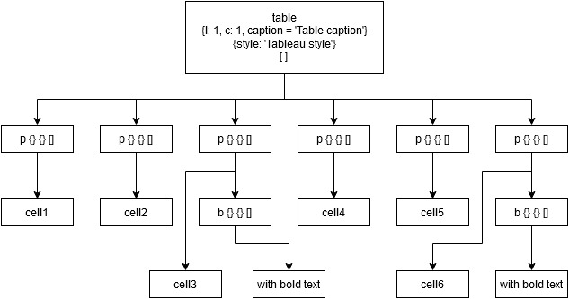
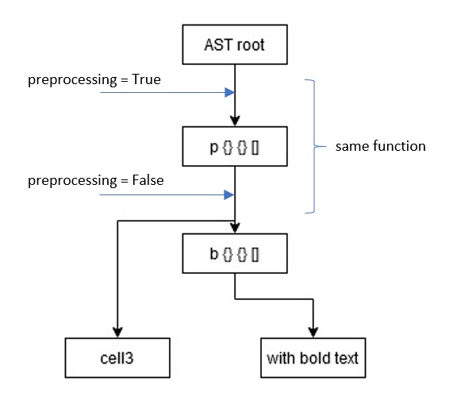

# PyDocx
This python script was developed to speed up Word document
writing. Thus, the script will compile a markup text file
into a readable and handsome Word document.
The whole markup language can be customized to meet your needs.
Indeed, it is possible to quickly modify every tag, the syntax
as well as implement new tags depending on your needs.
The major asset is to be able to define python routine that can
easily generate a fancy word document for few lines of codes.
For example, generating table from data stored in a file, automatically
applied the same style to many Word elements as set up image borders, 
captions, etc. 
# Table of content
1. [Structure of the project](#structure)
    1. [Abstract syntax tree](#AST)
    2. [tags.py](#tags_file)
    3. [styles.py](#styles_file)
    4. [settings.py](#settings_file)
        1. [Tags customization](#tags_custo)
        2. [Styles customization](#style_custo)
        3. [Alias](#alias)
        4. [Tags inheritance](#inheritance)
        5. [Syntax customization](#syntax_custo)
    5. [Global style and classes](#global_style)
2. [VsCode extension](#vscode)
## Structure of the project <a name="structure"></a>
### Abstract syntax tree <a name="AST"></a>
To generate the word document, the user must write a text file 
following a syntax he can totally customize. The syntax is based
on tags. A tag is just a keyword preceded by a special symbol.
For this document, the special symbol will be `£$` for tag opening
and `$£` for tag ending.
An example of text file could be :
```dqr
#Code Example 1
£$title:rank=1 This is a title 1 $£
    £$title:rank=2 This is a title 2 $£ 
    £$p 
        This is a paragraph
        £$b This is bold text $£
    $£p
    £$table:l=2:c=3:caption=Table_caption?style=Table_Style
        $£p cell1 $£p | $£p cell2 $£p | $£p cell3 £$b with bold text $£b $£p
        $£p cell4 $£p | $£p cell5 $£p | $£p cell6 £$b with bold text $£b $£p
    $£table
```
This text document will be used to generate the abstract language tree (AST).
In the AST, nodes are tag's name, option, style and class. 
To explain these notions, the line corresponding to the table definition
used in the `Code example 1` will be taken as an example.
- The name of the tag is the value of the tag, so here `table`
- The options of the tag are values which will affect the design
of the element once translated in Word document. In the example,
options are separated with the special character `:`. They are
l, c, and caption. l defined the number of lines, c the number of columns
and caption the content of the table caption.
- The style of the tag is the Word style that shall be applied to the element.
For example, the style with keyword `style` will apply the Word table style named
`Table Style`. Style properties are separated with the special character `?`
- The class of a tag is similar to html element class. It allows to
apply the same style to all tags with the same class. This will be
seen later.
Thus the each node of the AST will be composed of these four values.
Tree leaves will be raw text.
For the example of the table defined in `Code example 1`, the AST will be :
___

___
When this tree is generated, it will be traversed following his
infix course.
As said at the beginning, the whole syntax of the text file can 
be customized. Then, special character used before every tag, 
character used to split option, style and classes, as well as
the definition or redefinition of tags can be modified.
Literally everything can be modified.
To make it easier, the project is split in different files :
### tags.py <a name="tags_file"></a>
___
This file compiles python functions related to a tag.
For example, if a paragraph is defined by the tag `£$p`,
thus, a corresponding function need to be defined in the
file `tags.py` in order to handle the `£$p` tag.
Every function dedicated to tag handling must follow the
same prototype : `def function(document, option, value, parents_node, preprocessing=False)`
 with :
 - `document` : this variable represents the current element 
 in the Word document. For example, if the function handle a
 paragraph, the `document` parameter will represent the current
 Word paragraph
 - `option` : this parameter is the list of options given to the
 tag. Options are defined by the user when he writes his tag.
 - `value` : this is the content written between the opening tag
 and the closing tag. For example, in the following code : `£$p salut les copains $£p`
 `value` will be equal to `salut les copains`.
 - `parents_node` : this parameter is the list of all parents tag and their options
 of the current tag. For example, with the following code `£$p £$b salut £$b $£p`,
 the variable `parents_node` will be empty for the tag `£$p` and will equal to `£$p`
 for the tag `£$b`
 - `preprocessing` : this boolean parameter allows to perform actions before the content
 of the tag is evaluated and processed. The following image show
 where the code defined in the preprocessing part will be applied
 during the tree parsing.
 ___
 
 ___
 
 The following code is an example of function defining the tag
 `p` used to generate a Word paragraph:
 ```python
def p(document, option, value, parents_node, preprocessing=False):
    if preprocessing:
        if type(document) != _Cell or document.paragraphs[-1].text != "":
            document.add_paragraph('')
    else:
        document.paragraphs[-1].add_run(value)
 ```
Here, the preprocessing flag is used to generate the new paragraph,
then, once the paragraph is created, the function will be used to add
the value to the brand new paragraph.
### styles.py <a name="styles_file"></a>
___
Functions defined in this file will handle style of element whatever
it is inline style or style defined by classes.
As for tags function, style functions must follow the same 
prototype : `def function(document_elt, value)` where :
- `document_elt` is the element whose style must be applied
- `value` is the value of the style. For example, if the style
function is used to align paragraph, the value can be RIGHT, LEFT
, CENTER etc...
The following code is an example of style function allowing to
modify the alignment of a paragraph:
```python
def paragraph_align(paragraph, value):
    if type(paragraph) != list:
        paragraphs = [paragraph]
    else:
        paragraphs = paragraph
    for elt in paragraphs:
        elt.alignment = WD_ALIGN_PARAGRAPH.__dict__[value]
```
 
 ### settings.py <a name="settings_file"></a>
 ___
 This file is used to map all functions defined in tags.py, style.py
 and the tag name.
 
 #### Tags customization <a name="tags_custo"></a>
 The mapping done between the tag name and his function is done
 in the dictionary `tags_function`.
 For example, the following code :
 ```python
tags_function = {
    'p': tags_function_for_paragraph
}
 ``` 
This code maps the `tags_function_for_paragraph` to the tag `p`.
#### Styles customization <a name="style_custo"></a>
Style's properties are mapped with the `style_functions` dictionary.
This dictionary is defined as follows:
```python
style_functions = {
    'p': {
        align = lambda document, value: paragraph_align(document.paragraphs[-1], value)  
    },
}
```
#### Alias <a name="alias"></a>
Alias are tags writing shortcut. For example, if you know that all
image of your document must follow the same style or options, it is
possible to define alias.
For example, if all images must be bordered it is possible to 
define the following alias :
```dqr
img <=> img:border=5
```
Alias are defined in the dictionary `alias`. To make easier the
definition of alias, the function `gen_alias` can be used.
The following code is used to define alias :
```dqr
alias = {
    'img': gen_alias('img', options={'border': '5'}, style={}, classes=[]),
}
```
#### Tags inheritance <a name="inheritance"></a>
Sometime new tags will be defined, but styles that can be applied to this
new tag are the same than the one applied for another tag.
To avoid repeating every definition of the style for this new tag,
it is possible to simply define an inheritance link between these
two tags.
For example, the tag `filetable` is a tag that will generate a table
from data stored in a file. This tag is not the `table` tag but in
Word document it will be materialized in the same way : a table. Thus,
every style of `table` tag can also be applied to `filetable` tag.
The inheritance link can be done with the following code :
```python
inheritance([
    ('filetable', 'other_tag_looking_like_table', 'table'),
])
```
 
#### Syntax customization <a name="syntax_custo"></a>
 Moreover, it is in this file that every constant used can be 
 customized :
 ```dqr
split_char = '£$'
split_char_end = '$£'
split_options = ':'
split_class = '?'
split_style_props = '?'
split_style_value = '='
split_style = ':'
split_options_value = '='
split_cells = '|'
option_space_char = '_'
 ```
### Global style and classes <a name="global_style"></a>
It is possible to define global style in the text file using the tag `style`.
These style can be applied to all character sharing the same name or the same class.
For example, the following code :
```dqr
£$style
    fancy_img:align=CENTER?caption=Intense Quote
    p:align=LEFT
$£style
£$img:path=...?fancy_img image caption $£img
£$p This is a paragraph $£p
£$imgpath=... image caption $£img
```
With this code, only the first image will be centered because it
has the class `fancy_img`.
However, every paragraph defined by the tag `p` will be aligned to the left.
 
## VsCode extension <a name="vscode"></a>
To make easier the writing of text file, an extension for Visual Studio Code is 
supplied.
The extension is in the folder `dqrlanguage` and can be added to the
directory `.vscode`.
The extension provides syntax highlighting, some code snippet etc...
However, the visual extension is not linked to the `settings.py` file, thus,
if any change is made in the file, the changes must also be referred 
in all files of the extension.